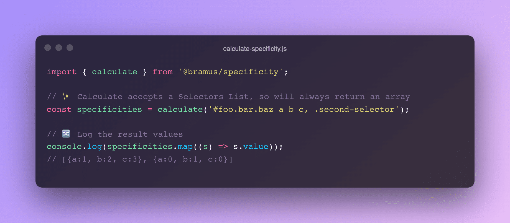

# Specificity

Package to calculate the Specificity of CSS Selectors. Also includes some convenience functions to compare, sort, and filter an array of specificity values.

Supports [Selectors Level 4](https://www.w3.org/TR/selectors-4/), including those special cases `:is()`, `:where()`, `:not()`, etc. 

## Installation

```bash
npm i @bramus/specificity
```

## Usage / Example

This library comes as an ES Module and exposes a `calculate` function which calculates the specificity of a given CSS SelectorList.

```js
import { calculate } from '@bramus/specificity';
const specificity = calculate('.foo :is(.bar, #baz)');
```

## The Return Format

Because `calculate` accepts a [Selector List](https://www.w3.org/TR/selectors-4/#grouping) — which can contain more than 1 [Selector](https://www.w3.org/TR/selectors-4/#selector) — it will always return an array. Contained in the array are instances of the `Specificity` class that also comes with `@bramus/specificity`.

The `Specificity` class includes methods to get the specificity value in a certain format, along with some convenience methods to compare it against other instances.

```js
import { calculate } from '@bramus/specificity';

// ✨ Calculate accepts a Selectors List, and will therefore always return an array
const specificities = calculate('#foo.bar.baz a b c, .second-selector');
specificities.map(s => `${s}`).join('\n');
// (1,2,3)
// (0,1,0)

// 🚚 The values in the array are instances of a Specificity class

// 🛠 From an instance you can get the value in various formats
const specificity = specificities[0]; // Instance of Specificity
specificity.value; // { a: 1, b: 2, c: 3 }
specificity.a; // 1
specificity.b; // 2
specificity.c; // 3
specificity.toString(); // "(1,2,3)"
specificity.toArray(); // [1, 2, 3]
specificity.toObject(); // { a: 1, b: 2, c: 3 }

// 💡 From an instance you can also get the selector (as a String)
specificity.selectorString(); // "#foo.bar.baz a b c"

// 💻 These instances also play nice with JSON.stringify()
console.log(JSON.stringify(specificity));
// {
//    "selector": '#foo.bar.baz a b c',
//    "asObject": { "a": 1, "b": 2, "c": 3 },
//    "asArray": [1, 2, 3],
//    "asString": "(1,2,3)",
// }

// 🔀 Need to compare against another instance? That's possible!
specificity.equals(specificities[1])); // false
specificity.isGreaterThan(specificities[1])); // true
specificity.isLessThan(specificities[1])); // false
```
## Helper Functions

This package also exposes some convenience functions to work with an array specificities:

- Comparison functions:
    - `compare(s1, s2)`: Compares s1 to s2. Returns a value that can be:
        - `> 0` = Sort s2 before s1 _(i.e. s2 is less specific than s1)_
        - `0` = Keep original order of s1 and s2 _(i.e. s2 and s1 are equally specific)_
        - `< 0` = Sort s1 before s2 _(i.e. s1 is more specific than s2)_
    - `equals(s1, s2)`: Returns `true` if s1 and s2 have the same specificity. If not, `false` is returned.
    - `greaterThan(s1, s2)`: Returns `true` if s1 has a higher specificity than s2. If not, `false` is returned.
    - `lessThan(s1, s2)`: Returns `true` if s1 has a lower specificity than s2. If not, `false` is returned.

- Sorting functions:
    - `ascending(specificities)`: Sorts the array of given specificities in ascending order _(low specificity to high specificity)_
    - `descending(specificities)`: Sorts the array of given specificities in descending order _(high specificity to low specificity)_
    - `sort(specificities, order = 'ASC')`: Sorts the array of given specificities in the give order (`'ASC'` or `'DESC'`)

- Filter functions:
    - `min(specificities)`: Filters out the value with the lowest specificity
    - `max(specificities)`: Filters out the value with the highest specificity

A specificity passed into any of these utility functions can be any of:

- An instance of the included `Specificity` class
- A simple Object such as `{'a': 1, 'b': 0, 'c': 2}`

All these functions are exported from the main `index.js` entrypoint.

```js
import {
    calculate,
    compare, equals, greaterThan, lessThan,
    ascending, descending, sort,
    min, max
} from '@bramus/specificity'
```

## License

`@bramus/specificity` is released under the MIT public license. See the enclosed `LICENSE` for details.

## Acknowledgements

The idea to create this package was sparked by [the wonderful Specificity Calculator created by Kilian Valkhof / Polypane](https://polypane.app/css-specificity-calculator/), a highly educational tool that not only calculates the specificity, but also explains which parts are responsible for it.

The heavy lifting of doing the actual parsing is done by [CSSTree](https://github.com/csstree/csstree).
